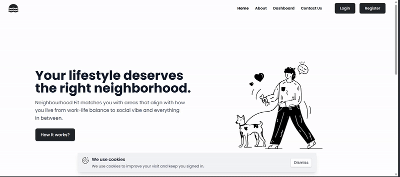

# 🏙️ NeighbourFit — Smart Neighborhood Finder

NeighbourFit is a lifestyle-focused web application that helps users find the most suitable neighborhoods based on their preferences — like rent, safety, greenery, nightlife, and more.  
Built for people who want more than just a house — they want a **vibe**.

---

## 🌟 Features

- 🧠 Intelligent lifestyle-to-location **matching algorithm**
- 📊 Visualized radar charts for easy comparison
- 🗺️ Google Maps integration for locality preview
- 📱 Responsive UI with smooth animations (Framer Motion)
- 🌐 Real-time reviews & preference-driven recommendations

---

## 🔧 Tech Stack

| Frontend  | Tools & Libraries           |
|-----------|-----------------------------|
| React     | ⚛️ Vite, JSX, Tailwind CSS  |
| Routing   | 🔁 React Router             |
| State Mgmt| 🧠 useState, useEffect      |
| Animations| 🎞️ Framer Motion           |
| Charts    | 📈 Recharts                 |
| Maps      | 🗺️ Google Maps API          |

---

## 🚀 Getting Started

### 🛠️ Setup Locally

```bash
git clone https://github.com/YourUsername/NeighbourFit-frontend.git
cd NeighbourFit-frontend
npm install
npm run dev

## 🌐 Live Demo

🌍 **Frontend Deployed At:**  
[https://neighbourfit-frontend.onrender.com](https://neighbourfit-frontend.onrender.com)
